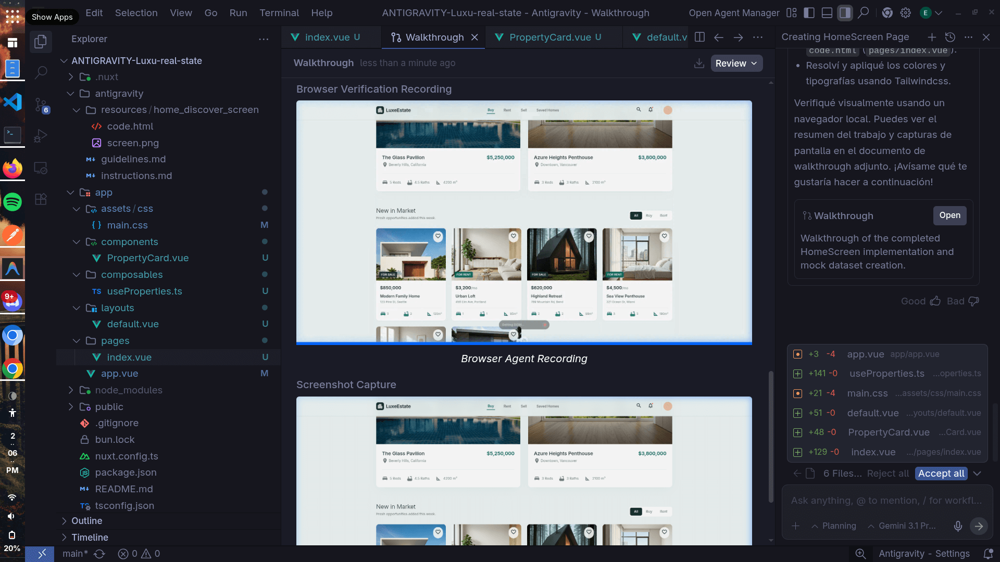
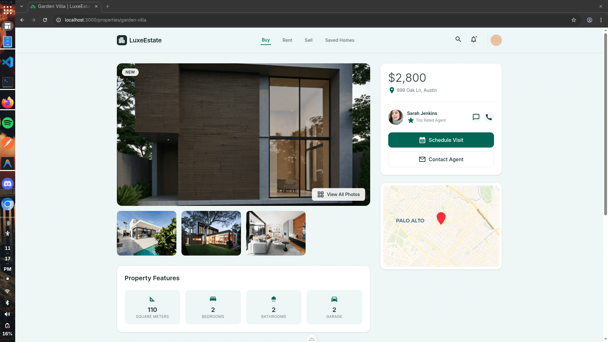

# 🏡 Luxe Estate

> A modern, premium, and minimalist real estate application.

Welcome to the **Luxe Estate** repository. This project aims to deliver a high-end experience for finding and managing real estate properties, featuring a clean design and smooth interactions.

---

## � Vibe Coding & AI Generation

This application is built using a **"full vibe coding"** approach. Vibe coding is a modern development paradigm where software is built by directing AI agents through natural language and creative intent, rather than manually writing syntax.

The development is driven by **[Antigravity](https://antigravity.google/)** — a powerful, advanced agentic AI coding assistant designed by the Google DeepMind team. Antigravity acts as an autonomous pair programmer, capable of implementing features, refactoring, and managing the project directly within the IDE based on the provided guidelines (`instructions.md` and `guidelines.md`).





> **Initial Template:** This project used **[Google Stitch](https://stitch.withgoogle.com/)** to generate its initial scaffolding. 
> There are also other viable alternatives for UI/project generation such as: **[v0 by Vercel](https://v0.dev/)**, **[Lovable](https://lovable.dev/)**, and **[Bolt AI Builder](https://bolt.new/)**.

---

## 🛠 Tech Stack

### Frontend
-  **Nuxt.js 4** – Vue framework with SSR and static generation
-  **Vue.js 3** – Progressive JavaScript framework
-  **Tailwind CSS 4** – Utility-first CSS framework
-  **TypeScript** – Typed superset of JavaScript
- **Nuxt Image** – Image optimization for Nuxt
-  **Leaflet** – Open-source JavaScript library for interactive maps

### Backend & Database
-  **Supabase** – Open source Firebase alternative

---

## 🎨 Design System

We follow a strict, minimalist, and premium design system:

### Typography
- **Mandatory Font:** SF Pro Display

### Color Palette
- 🌃 **Nordic (`#19322F`)**: Main Dark Color (Headers, Navigation, Main Text)
- 🌊 **Mosque (`#006655`)**: Primary Action Color (Primary Buttons)
- 🍃 **Touch of Green (`#D9ECC8`)**: Soft Background (Featured Cards)
- ☁️ **Clear Day (`#EEF6F6`)**: General Application Background


## 🚀 Setup & Development

Make sure to install the dependencies:

```bash
bun install
```

### Development Server

Start the development server on `http://localhost:3000`:

```bash
bun run dev
```

### Production

Build the application for production:

```bash
bun run build
```

Locally preview the production build:

```bash
bun run preview
```

---

## 📖 Development Guidelines

1. **Reusability:** Work with the intention of reusing components and styles.
2. **Componentization:** Create components for cards or any recurring elements.
3. **Structure:** Manage folders and subfolders according to the pages you are working on.
4. **Dependencies:** Do not configure or install external libraries without consulting first.

---

## 🛠 Troubleshooting

### MCP Supabase Error: `npx` not found
When working on **Arch Linux** with **NVM (Node Version Manager)**, you might encounter an error in AI environments stating that `npx` is not found. This happens because background processes (like MCP servers) often run in non-interactive shells that don't load the NVM path.

#### Solution
We've provided a script to create a symbolic link for `npx` in a system-wide path (`/usr/local/bin`), making it accessible to all processes.

1. Run the fix script:
   ```bash
    NPX_PATH="/home/username/.nvm/versions/node/v24.11.1/bin/npx"
    TARGET_PATH="/usr/local/bin/npx"

    if [ -f "$TARGET_PATH" ]; then
        echo "A file already exists at $TARGET_PATH."
        ls -l "$TARGET_PATH"
    else
        echo "Creating symlink for npx..."
        sudo ln -s "$NPX_PATH" "$TARGET_PATH"
        if [ $? -eq 0 ]; then
            echo "Successfully created symlink at $TARGET_PATH"
        else
            echo "Failed to create symlink. Please check sudo permissions."
        fi
    fi

    # Verify
    echo "Verifying npx availability..."
    if command -v npx > /dev/null; then
        echo "npx is now available in your PATH."
        npx --version
    else
        echo "npx is still not available in your PATH. You might need to restart your shell."
    fi

   ```
2. The script will look for your local `npx` path and ask for `sudo` permissions to create the link.

---

*Look at the [Nuxt documentation](https://nuxt.com/docs/getting-started/introduction) for more framework-specific details.*
